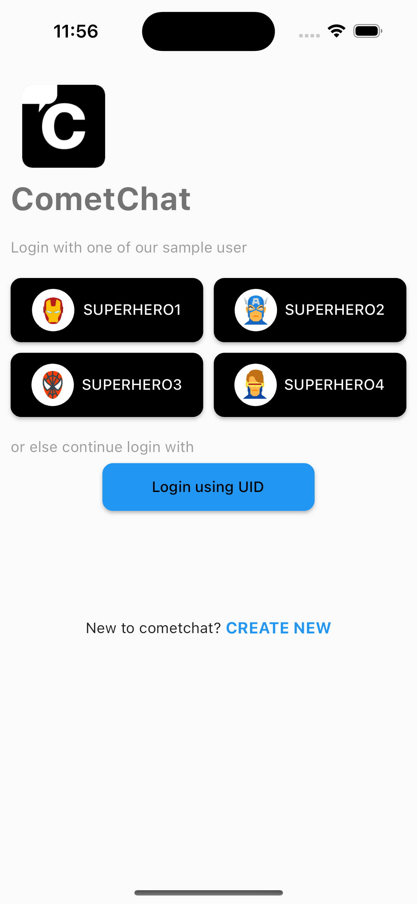

<p align="center">
  
</p>

# Flutter Sample App by CometChat

This reference application showcases the integration of [**CometChat's Flutter UI Kit**](https://www.cometchat.com/docs/v4/flutter-uikit/overview) within an Flutter framework. It provides developers with examples of implementing real-time messaging and voice and video calling features in their Flutter-based applications.

## Prerequisites

- XCode for iOS and Android Studio for Android
- pod (CocoaPods) for iOS
- Android device or emulator with Android version 5.0 or above.
- An iOS device or emulator with iOS 12.0 or above.
- Sign up for a [CometChat](https://app.cometchat.com/) account to get your app credentials: _`App ID`_, _`Region`_, and _`Auth Key`_


## Installation
1. Clone the repository:
	```
	git clone https://github.com/cometchat/cometchat-sample-app-flutter.git
	```

2. Navigate to the project directory:
	```sh
	cd cometchat-sample-app-flutter
	```

3. Install flutter dependencies
	```sh
	flutter pub get
	```

4. Enter your CometChat _`App ID`_, _`Region`_, and _`Auth Key`_ in the [lib/app_constants.dart](lib/app_constants.dart) file:
   https://github.com/cometchat/cometchat-sample-app-flutter/blob/b67064409ec5c875aca74fd2eff5e80968c485c7/lib/app_constants.dart#L1-L5

5. For iOS, install dependencies after navigating to ios :
	```sh
  	cd ios
	pod install
	```
	If you are facing any issue with pod install, you can try running the following command:
	```sh
  	pod update
	```
 
6. Open a Simulator or connect a physical device.

7. Run the app on a device or emulator from the repo root.
	```sh 
	flutter run
	```
   
   


## Help and Support
For issues running the project or integrating with our UI Kits, consult our [documentation](https://www.cometchat.com/docs/flutter-uikit/integration) or create a [support ticket](https://help.cometchat.com/hc/en-us) or seek real-time support via the [CometChat Dashboard](https://app.cometchat.com/).
