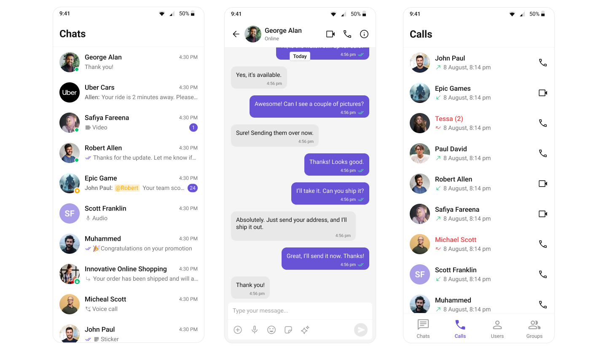

# CometChat Flutter UI Kit

CometChat's Flutter UI Kit offers a set of prebuilt, customizable UI components
that let you add text chat, media messaging, reactions, threads, and voice/video
calling to your Flutter app with minimal development effort.



## Features

- **Conversations, Messages & Composer** — ready-made list, message, and input
  widgets with receipts, reactions, replies, and threads.
- **Users & Groups** — browse users, manage groups, and handle group members.
- **Voice & Video Calling** — optional calling UI powered by the CometChat Calls
  SDK.
- **Theming & Localization** — fully themeable components with built-in
  translations for many locales.
- **Cross-platform** — Android, iOS, and Web.

## Installation

Add the package to your `pubspec.yaml`:

```yaml
dependencies:
  cometchat_chat_uikit: ^6.0.3
```

Then run:

```sh
flutter pub get
```

## Quick start

1. Create an app in the [CometChat Dashboard](https://app.cometchat.com/) and
   note your **App ID**, **Region**, and **Auth Key**.
2. Initialize the UI Kit and log a user in:

```dart
import 'package:flutter/material.dart';
import 'package:cometchat_chat_uikit/cometchat_chat_uikit.dart';

Future<void> initCometChat() async {
  final uiKitSettings = (UIKitSettingsBuilder()
        ..subscriptionType = CometChatSubscriptionType.allUsers
        ..region = '<YOUR_REGION>'
        ..appId = '<YOUR_APP_ID>'
        ..authKey = '<YOUR_AUTH_KEY>'
        ..autoEstablishSocketConnection = true)
      .build();

  CometChatUIKit.init(
    uiKitSettings: uiKitSettings,
    onSuccess: (_) {
      CometChatUIKit.login('<UID>', onSuccess: (_) {}, onError: (_) {});
    },
    onError: (_) {},
  );
}
```

3. Drop a component into your widget tree:

```dart
const SafeArea(child: CometChatConversations());
```

A complete, runnable sample lives in [`example/`](example/).

## Documentation

- [Flutter UI Kit documentation](https://www.cometchat.com/docs/ui-kit/flutter/overview)
- [CometChat Dashboard](https://app.cometchat.com/)

## License

This project is licensed under the [MIT License](LICENSE).
